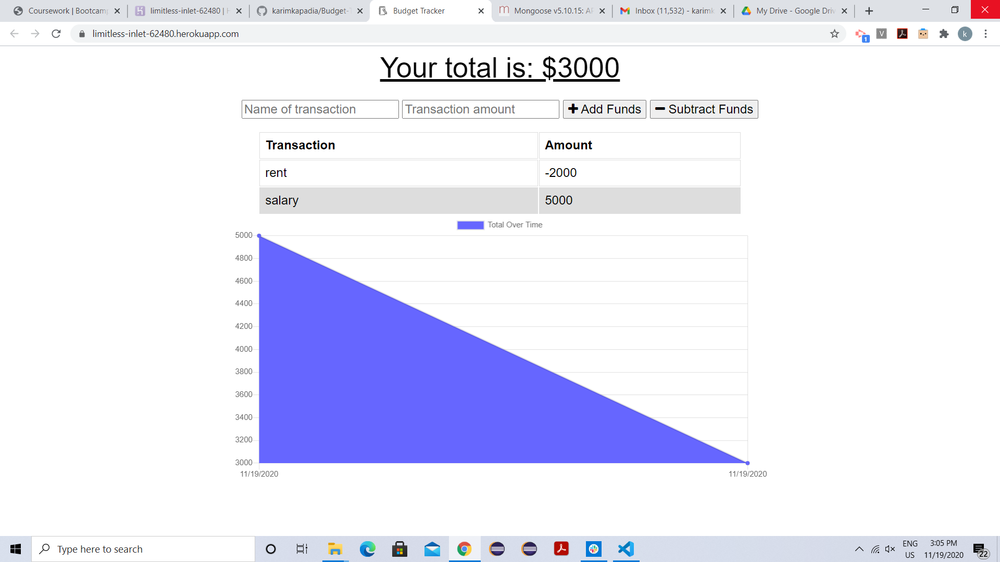
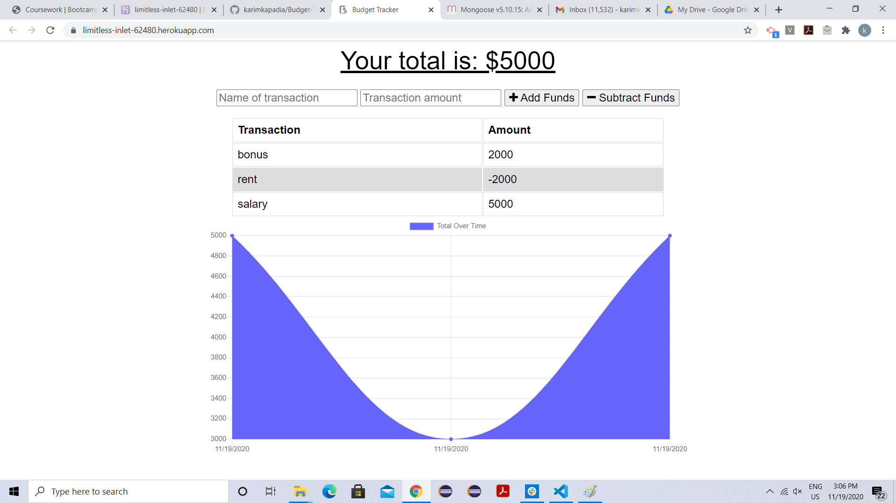
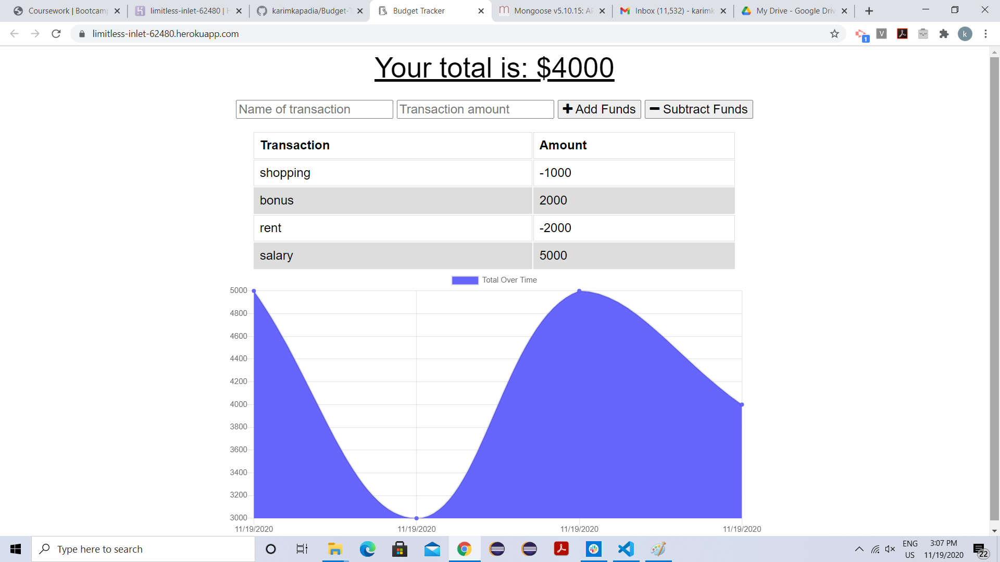
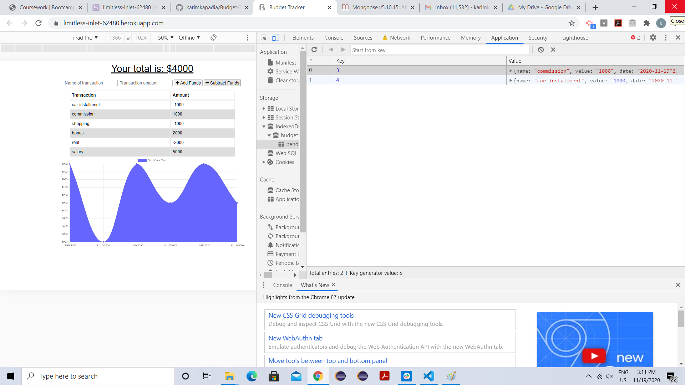
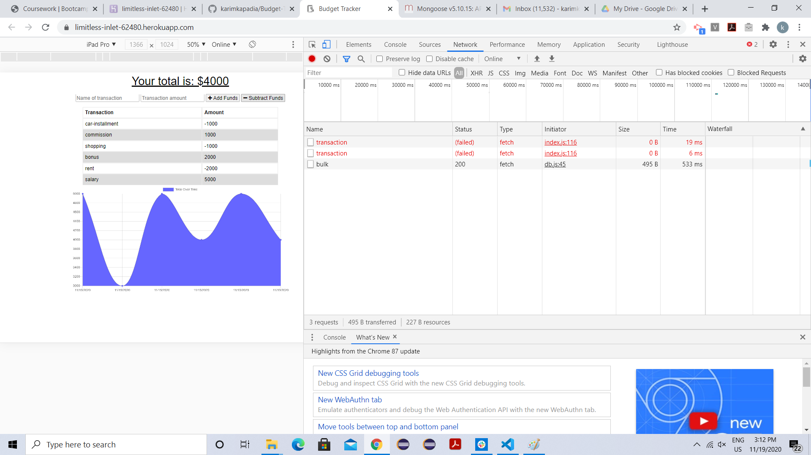

# Budget-Trackers-Homework-18
This is a budge tracker application in which user will be able to add expenses and deposits to their budget with or without a connection. When  user enters transactions offline, it will be  cached and when user get online all those entries will be reflected in the database.

# Images 

# links
Heroku deployed app link: https://limitless-inlet-62480.herokuapp.com/

Github link: https://github.com/karimkapadia/Budget-Trackers-Homework-18
